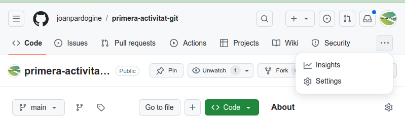
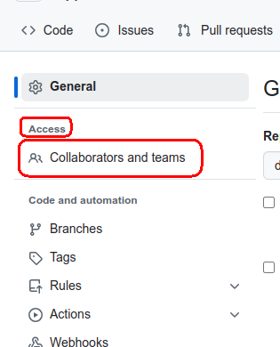
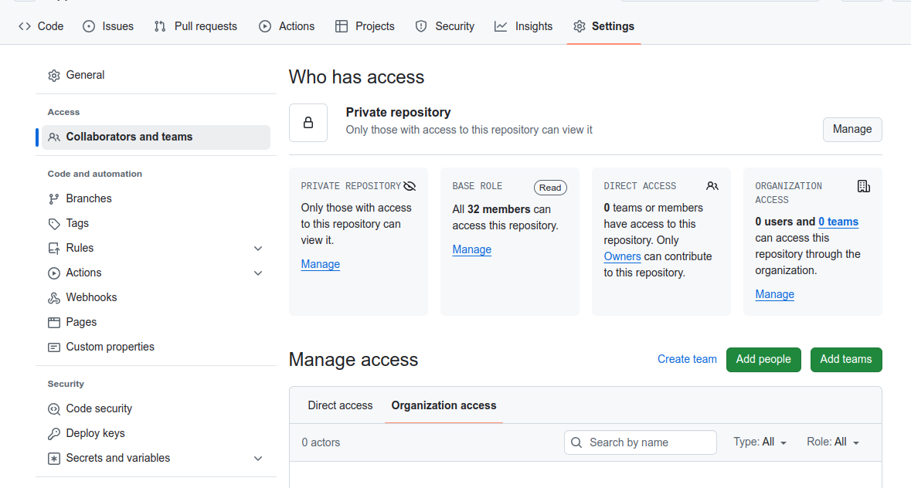
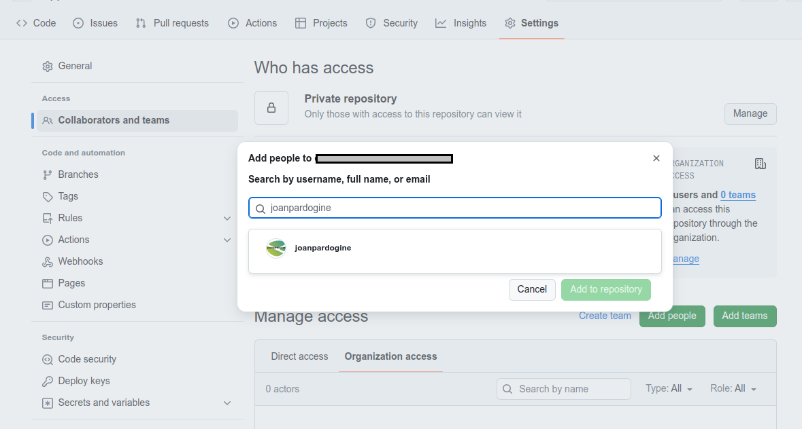
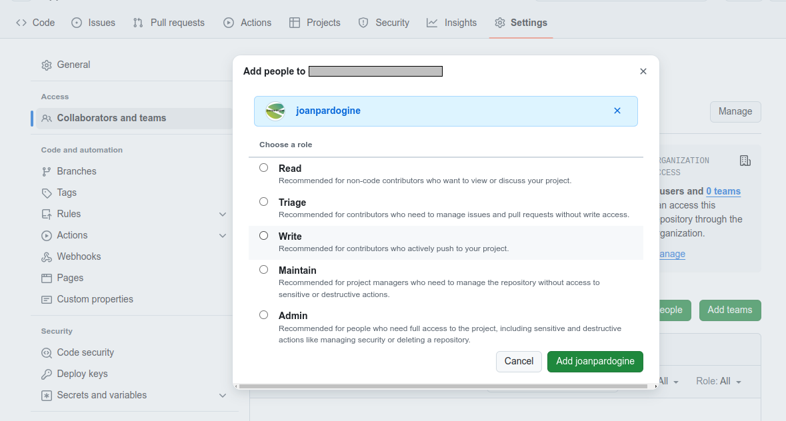
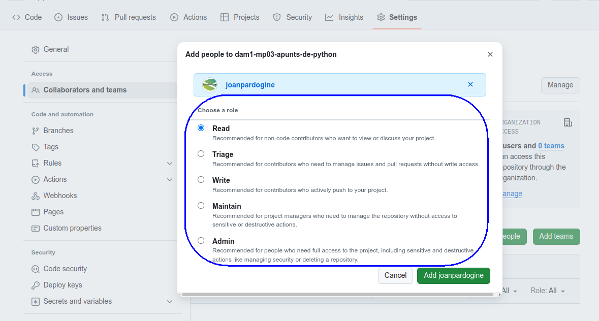
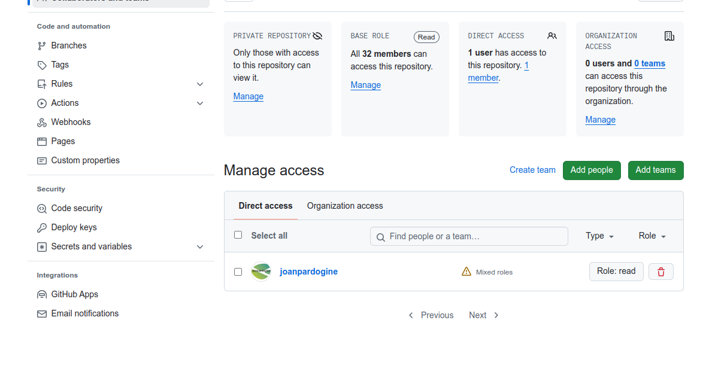

# Explicació de git

[Git Tutorial](https://www.w3schools.com/git/default.asp?remote=github)


<details>
<summary>Index</summary>

1. [Instal·lar **```git```** a **```Windows```**](./README.md#installar-git-a-windows)

1. [Comanda **```git status```** per veure l'estat del repositori](./README.md#comanda-git-status-per-veure-lestat-del-repositori)

1. [Inicialitzar un repositori](./README.md#inicialitzar-un-repositori)

1. [Crear i configurar l'usuari de **`github.com`**](./README.md#crear-i-configurar-lusuari-de-githubcom)

1. [Afegir fitxers, i comanda **```commit```**.](./README.md#afegir-fitxers-i-la-comanda-commit)


1. [Convidar un col·laborador a un repositori personal](./README.md#convidar-un-collaborador-a-un-repositori-personal)

</details>

<hr>

> [!TIP]
> Per més informació podeu consultar [Què és **`Git`**?](./documents/que-es-git.md)
>

<hr>

## Instal·lar git a Windows

* Descarregar el programa ```git``` des de la web [Git-2.39.1-64-bit.exe](https://github.com/git-for-windows/git/releases/download/v2.39.1.windows.1/Git-2.39.1-64-bit.exe)

* Pàgina web oficial de [GitHub](https://github.com)

**1.** Crear la carpeta contenidora del nostre projecte.


Per tal d'unificar la nostra explicació, crearem una carpeta que anomenarem **```<CognomAlumne>-primer-repositori```**, (on **```<CognomAlumne>```** és el **cognom de l'alumne**, sense el **nom**, per exemple en el meu cas seria **```pardo-primer-repositori```**) i serà la que farem servir per guardar i centralitzar el projecte o repositori **```<CognomAlumne>-primer-repositori```**.
En el meu cas, la crearé dins de la unitat **```D:```** del meu equip. Com veieu des de la **`shell`** de **Linux** per accedir a la unitat **```D:```** cal accedir amb **```/d/```**.

Per crear l'esmentada carpeta, executarem les següents comandes:

**Comandes**:

```sh
mkdir <CognomAlumne>-primer-repositori
cd <CognomAlumne>-primer-repositori
pwd
```

> [!TIP]
>
> **Sortida**
><pre>
> ~$ mkdir <CognomAlumne>-primer-repositori
> ~$ cd <CognomAlumne>-primer-repositori
> ~/pardo-primer-repositori $ pwd
> \d\<CognomAlumne>-primer-repositori
></pre>

## Comanda **```git status```** per veure l'estat del repositori

Existeix una comanda ([**`git status`**](https://git-scm.com/docs/git-status)) que ens mostra en quin **estat** es troba el nostre repositori.

Un cop ja siguem dins de la carpeta que acabem de crear podem provar d'executar la comanda **``git status``** que ens mostrarà quin és l'estat del repositori.

**Comanda**:

```sh
git status
```

> [!TIP]
>
> **Sortida**
><pre>
> ~/pardo-primer-repositori $ git status
> fatal: not a git repository (or any of the parent directories): .git
> ~/pardo-primer-repositori $
></pre>

Obtenim un **error**, és normal!

> [!WARNING]
>
> <pre>fatal: not a git repository (or any of the parent directories): .git
> </pre>
> <pre>
> fatal: no és un repositori git (ni cap dels directoris pare): .git
> </pre>
> <hr>

L'**error** ens diu que **no és un repositori**. Això és totalment normal, ja que per defecte, **cap carpeta és un repositori**.

<hr>

## Inicialitzar un repositori

Per fer que la nostra carpeta sigui un repositori, és a dir, per dir-li a **```git```** que volem que porti el control dels canvis al fitxers, cal que executem la comanda **```git init```**.

**Comanda**:

```sh
git status
```

> [!TIP]
>
> **Sortida**
><pre>
> ~/pardo-primer-repositori $ git init
> Initialised empty Git repository in /d/pardo-primer-repositori/.git/
> ~/pardo-primer-repositori $ 
>```

Ens mostra el missatge (**```Initialised empty Git repository in /d/pardo-primer-repositori/.git/```**), és a dir, que s'ha inicialitzat com a **repositori buit** la ruta (**``/d/pardo-primer-repositori/.git/``**).`

> [!CAUTION]  
>
> ## **NOTA IMPORTANT**
> ### Tingueu present que si a un repositori que ja teniu creat, torneu a executar la comanda **```git init```**, eliminarà tota la informació dels canvis que ha registrat fins al moment i crearà, com ja s'ha comentat, un **repositori buit**.
> <br>
<br>

Tanmateix, si mirem el contingut de la carpeta **```<CognomAlumne>-primer-repositori```** amb un **```ls -l```** o amb un **```dir```**, veiem que, aparentment no hi ha res creat.

**Comanda**:

```sh
ls -l
```

> [!TIP]
>
> **Sortida**
><pre>
> ~/pardo-primer-repositori $ ls -l
> total 0
> ~/pardo-primer-repositori $
></pre>

Però si executem la comanda perquè mostri els fitxers ocults **```ls -la```** o **```dir /a```**, llavors sí que veiem que hi ha una carpeta nova anomenada **```.git```**, el que passa és que és oculta.

**Comanda**:

```sh
ls -la
```

> [!TIP]
>
> **Sortida**
><pre>
> ~/pardo-primer-repositori $ ls -a
> total 12
> drwxrwxr-x 3 user user 4096 Sep 24 13:00 .
> drwxrwxrwx 7 user user 4096 Sep 24 13:00 ..
> drwxrwxr-x 7 user user 4096 Sep 24 13:00 .git
> ~/pardo-primer-repositori $
></pre>

Aquesta carpeta **```.git```** és la que conté tota la informació de **```git```** sobre el projecte. Cada vegada que es facin canvis, ja sigui afegint fitxers, modificant el contingut dels fitxers, creant o esborrant subcarpetes ,etc aquests canvis s'aniran guardant en aquesta carpeta. Per tant, **és important** que no l'esborreu, ni li feu res, ja que és **imprescindible** per poder interactuar amb **```git```**.

Si accedim a aquesta carpeta **```.git```** amb un **```cd .git```**, i llistem el contingut amb **```ls -l```** o amb **```dir```** podrem veure tot el contingut que necessita **```git```** per funcionar.

**Comanda**:

```sh
cd .git
```

> [!TIP]
>
> **Sortida**
><pre>
> ~/pardo-primer-repositori $ cd .git
> ~/pardo-primer-repositori/.git$ ls -l
> total 32
> drwxrwxr-x 2 user user 4096 Sep 24 13:00 branches
> -rw-rw-r-- 1 user user   92 Sep 24 13:00 config
> -rw-rw-r-- 1 user user   73 Sep 24 13:00 description
> -rw-rw-r-- 1 user user   23 Sep 24 13:00 HEAD
> drwxrwxr-x 2 user user 4096 Sep 24 13:00 hooks
> drwxrwxr-x 2 user user 4096 Sep 24 13:00 info
> drwxrwxr-x 4 user user 4096 Sep 24 13:00 objects
> drwxrwxr-x 4 user user 4096 Sep 24 13:00 refs
> ~/pardo-primer-repositori/.git$ 
></pre>

Però, si ara tornem enrere, amb **```cd ..```**, és a dir, a la carpeta **```<CognomAlmune>-primer-repositori```** i executem la comanda **```git -status```**, la resposta rebuda és una altra.

**Comanda**:

```sh
git status
```

> [!TIP]
>
> **Sortida**
><pre>
> ~/pardo-primer-repositori/.git$ cd ..
> ~/pardo-primer-repositori $ git status
> On branch main
> 
> No commits yet
> 
> nothing to commit (create/copy files and use "git add" to track)
> 
> ~/pardo-primer-repositori $
></pre>

Ens mostra els següents missatges que volen dir:

* **```On branch main```**, que ens trobem a la **branca** (**```branch```**) **principal** (**```main```**)
* **```No commits yet```**, que encara no hi ha res per confirmar (**```commit```**) i per últim,
* **```nothing to commit (create/copy files and use "git add" to track)```**, que en aquests moments no hi ha res per a fer el **`commit`**, i que si volem afegir fitxers perquè comenci a gestionar la traçabilitat d'aquests, cal que fem servir la comanda **```git add```** per afegir els fitxers a la llista dels fitxers que volem afegir a la traçabilitat del repositori.

Fins ara **NO** hem fet res més que indicar quina és la carpeta del nostre repositori. Però ja estem preparats per crear i/o modificar fitxers i dur el control dels canvis que fem sobre aquests.

<hr>

## Crear i configurar l'usuari de **`github.com`**

Abans de seguir cal crear usuari de [**`github.com`**](https://github.com/) i posteriorment configurar la nostra instal·lació de **`git`** al nostre ordinador.

### Creació d'un usuari a [**`github.com`**](https://github.com/)

Per registrar un compte personal nou cal seguir els següents passos:

**1.** Ves a [**`github.com`**](https://github.com/)

**2.** Feu clic a <kbd>Sign up</kbd> (**Registrar-se**)

**3.** Segueix les indicacions per crear el teu compte personal.

Durant el registre, se us demanarà que verifiqueu la vostra adreça de correu electrònic. Sense una adreça de correu electrònic verificada, no podreu completar algunes tasques bàsiques de GitHub, com a crear un repositori.

Si teniu problemes per comprovar la direcció de correu electrònic, hi ha alguns passos de solució de problemes que podeu seguir. Per obtenir més informació, a [**Verifying your email address.**](https://docs.github.com/en/account-and-profile/setting-up-and-managing-your-personal-account-on-github/managing-email-preferences/verifying-your-email-address#troubleshooting-email-verification).

[**Signing up for a new personal account**](https://docs.github.com/en/get-started/start-your-journey/creating-an-account-on-github#signing-up-for-a-new-personal-account)

> ### Un cop acabat el procès de registre del vostre usuari a **`github.com`** cal que us recordeu el vostre <u>nom d'usuari de **`github.com`**</u> i l'<u>adreça de correu</u> que heu vinculat al vostre usuari a [github.com](https://github.com/).

### Establir el vostre nom d'usuari de Git per a cada repositori del vostre ordinador

**1.** Obriu **`Git Bash`**.

**2.** Configureu el vostre nom d'usuari de **`git`**:

**Comanda**:

```sh
git config --global user.name "<nom_d_usuari_de_git>"
```

> [!TIP]
>
> **Sortida**
><pre>
> git config --global user.name "MonaLisa"
></pre>

**3.** Confirmeu que heu definit correctament el nom d'usuari de Git:

**Comanda**:

```sh
git config --global user.name
```

> [!TIP]
>
> **Sortida**
><pre>
> $ git config --global user.name
> MonaLisa
></pre>

[**Setting your Git <u>username</u> for every repository on your computer**](https://docs.github.com/en/get-started/getting-started-with-git/setting-your-username-in-git#setting-your-git-username-for-every-repository-on-your-computer)

### Establir la vostra adreça de correu electrònic per a cada repositori del vostre ordinador

**1.** Obriu **`Git Bash`**.

**2.** Configureu la vostra adreça de correu electrònic de **`git`**:

Cal que utilitzeu l'adreça de correu electrònic que heu proporcionat a GitHub quan heu registrat el vostre nom d'usuari de Git.

**Comanda**:

```sh
git config --global user.email "elteucorreu@exemple.cat"
```

**3.** Confirmeu que heu configurat correctament l'adreça de correu electrònic a Git:

**Comanda**:

```sh
git config --global user.email
```

> [!TIP]
>
> **Sortida**
><pre>
> $ git config --global user.email
> elteucorreu@exemple.cat
></pre>

Afegiu l'adreça de correu electrònic al vostre compte a GitHub, de manera que els vostres **`commits`** s'atribueixin a vosaltres i apareguin al vostre gràfic de contribucions.

[**Setting your <u>email address</u> for every repository on your computer**](https://docs.github.com/en/account-and-profile/setting-up-and-managing-your-personal-account-on-github/managing-email-preferences/setting-your-commit-email-address#setting-your-email-address-for-every-repository-on-your-computer)

<hr>

## Afegir fitxers, i la comanda **```commit```**.

Per començar crearem dos fitxers.

1. **```index.html```** i
1. **```estils.css```**.

### **1.** Fitxer **```index.html```**,

El primer dels fitxers l'anomenem **```index.html```**, i afegim el text bàsic per crear una senzilla pàgina web.

Podeu fer servir el **```Notepad```** de **Windows**. Per fer-ho pressioneu la tecla de <kbd>Windows</kbd> + <kbd>R</kbd> i escriviu **```notepad.exe```**, i així us obrirà el **```Notepad```**.

Copieu el següent codi:

```html
<html lang="ca">
  <head>
    <meta charset="utf-8">
    <title>Activitat primer repositori</title>
    <link rel="stylesheet" href="./estil.css">
</head>
<body>
    <h1>Primera activitat</h1>
    <p>Aquesta és la meva primera activitat amb <span>git</span></p>
</body>
</html>
```

I guardeu el fitxer a la vostra ruta:

> [!TIP]
>
> **Sortida**
><pre>
> &lt;CognomAlumne>-primer-repositori
></pre>

Un cop que hem creat, modificat i guardat aquest primer fitxer, anem a veure què és el que ens diu **```git```**.

**Comanda**:

```sh
git status
```

> [!TIP]
>
> **Sortida**
><pre>
> 
> ~/pardo-primer-repositori $ git status
> On branch main
> 
> No commits yet
> 
> Untracked files:
>   (use "git add <file>..." to include in what will be committed)
>         index.html
> 
> nothing added to commit but untracked files present (use "git add" to track)
> ~/pardo-primer-repositori $ 
><pre>

Ara apareix una secció **```Untracked files```**, É a dir, una apartat a on ens mostra aquells fitxers, que no estan **marcats** per controlar els seus els canvis, és a dir que ***NO* tenen de traça**.

és a dir, que el fitxer **```index.html```**, no està marcat per controlar els canvis que es facin sobre ell.

A part, apareix la següent explicació:
```sh
use "git add ..." to include in what will be committed
```

La comanda **```git add ...```** afegeix un fitxer al repositori local i el prepara per a la confirmació. Per eliminar o treure un fitxer, cal fer servir **```git reset HEAD <<nomFitxer>>```**.

és a dir, que cal fer servir "**```git add ...```**" per incloure els fitxers que volem que **```git```** comenci a controlar.

I per últim ens indica:

```sh
nothing added to commit but untracked files present (use "git add" to track)
```

Que tot i que hi ha **fitxers sense traça** (**```untracked files```**), no hi ha res afegit per **confirmar**, és a dir per incloure en el següent control. I ens indica que cal fer per afegir fitxers al control, "**```(use "git add" to track)```**, és a dir feu servir **```git add```** per afegir fitxers a traçar.

Fixeu-vos que aquests fitxers sense traça, apareixen de color vermell, i en el nostre cas apareix el fitxer **```index.html```** que acabem d'afegir, Però com que no l'hem afegit al control de traça, **``git``** encara no el té a la llista de fitxers a controlar.

Ara mateix, per molt que nosaltres el modifiquem el fitxer **```index.html```**, **``git``** mai detectarà els canvis, ni controlarà els canvis que fem sobre aquest fitxer.

Perquè **```git```** tingui present el fitxer **```index.html```**, cal afegir-lo.

I per així existeix la comanda **```git add <nomDelFitxer>```**.

**Comanda**:

```sh
git add index.html
```

> [!TIP]
>
> **Sortida**
><pre>
> 
> ~/pardo-primer-repositori $ git add index.html
></pre>

Un cop que hem afegit el fitxer **```index.html```**, anem a veure quin és l'estat del nostre repositori amb **```git status```**.

**Comanda**:

```sh
git status
```

> [!TIP]
>
> **Sortida**
><pre>
> 
> ~/pardo-primer-repositori $ git status
> On branch main
> 
> No commits yet
> 
> Changes to be committed:
>   (use "git rm --cached <file> ..." to unstage)
>         new file:   index.html
> 
> ~/pardo-primer-repositori $ 
></pre>

Un cop afegit el fitxer **```index.html```**, si tornem a executar la comanda **```git status```**, ara apareix un nou missatge **```Changes to be committed```** és a dir, canvis per ser controlats. I el fitxer **```index.html```** ja apareix com a fitxer nou i de color verd.

Ara és el moment de fer un **```commit```**. Un **```commit```** o **confirmació** és un **punt de control** en el nostre projecte. 

Acabarem tenint molts **```commit```**'s, cada vegada que fem alguna cosa important o prou rellevant. Com un petit **punt de control** al qual sempre podrem tornar

Per tant, és **molt recomanable** realitzar aquests **```commit```**'s, per exemple cada vegada es crea un nou fitxer, o afegim una única funció de **```javascript```** (per exemple), o hem modificat alguns estils, etc.

És a dir, cal fer un **```commit```** cada vegada que es vulgui crear un **punt de control**, que volem recordar, o al que volem poder tornar més endavant.

Per fer-ho, cal fer servir, la comanda **```git commit```** amb el paràmetre **```-m```**, per afegir-li un **missatge**, comentari o nom que l'identifiqui. I tot i que és possible no afegir cap missatge, és molt recomanable, afegir-ne un que sigui útil i descriptiu sobre el que acabem de fer. Com per exemple, **```Creat el fitxer index.html```**.
així ens serà molt útil per més endavant, per quan veiem el log dels **```commit```**'s, puguem reconèixer a cadascun d'ells i saber que és el que vam fer just en aquell moment.

**Comanda**:

```sh
git commit -m "Creat el fitxer index.html"
```

> [!TIP]
>
> **Sortida**
><pre>
> 
> ~/pardo-primer-repositori $ git commit -m "Creat el fitxer index.html"
> [main (root-commit) 74859bc] Creat el fitxer index.html
> 1 file changed, 10 insertions(+)
> create mode 100644 index.html
> 
> ~/pardo-primer-repositori $ 
></pre>


<hr>


> [!CAUTION]  
>
><details>
> <summary>Si us apareix un error a l'hora de fer el commit</summary>
> 
> > <hr>
> >
> > ## Si us apareix un error a l'hora de fer el **```commit```**, reviseu els següents punts:
> > ### [Establir el vostre nom d'usuari de Git per a cada repositori del vostre ordinador](/README.md#establir-el-vostre-nom-dusuari-de-git-per-a-cada-repositori-del-vostre-ordinador)
> > 
> > ### [Establir la vostra adreça de correu electrònic per a cada repositori del vostre ordinador](/README.md#establir-la-vostra-adreça-de-correu-electrònic-per-a-cada-repositori-del-vostre-ordinador)
> > <hr>
> </details>


### **2.** Fitxer **```estils.css```**.

Podeu fer servir el **```Notepad```** de **Windows**. Per fer-ho pressioneu la tecla de <kbd>Windows</kbd> + <kbd>R</kbd> i escriviu **```notepad.exe```**, i així us obrirà el **```Notepad```**.

Copieu el següent codi al fitxer **```estils.css```**

```css
body {
	font-family: sans-serif;
	text-align: center;
	padding: 3rem;
	font-size: 1.125rem;
	line-height: 1.5;
	transition: all 725ms ease-in-out;
}

h1 {
	font-size: 2rem;
	font-weight: bolder;
	margin-bottom: 1rem;
}

p {
	margin-bottom: 1rem;
	color: tomato;
}

button {
	cursor: pointer;
	appearance: none;
	border-radius: 4px;
	font-size: 1.25rem;
	padding: 0.75rem 1rem;
	border: 1px solid navy;
	background-color: dodgerblue;
	color: white;
}
```


> [!TIP]
>
> **Sortida**
><pre>
> ~/pardo-primer-repositori $ touch estils.css
> ~/pardo-primer-repositori $ ls -l
> -rw-rw-r-- 1 user user 130 Sep 24 13:00 index.html
> -rw-rw-r-- 1 user user   0 Sep 24 13:00 estils.css
> 
> ~/pardo-primer-repositori $ 
></pre>

Anem a veure què ha passat al git.

```sh
~/pardo-primer-repositori $ git status
On branch main
Untracked files:
  (use "git add <file>..." to include in what will be committed)
           main.js
           estils.css

nothing added to commit but untracked files present (use "git add" to track)

~/pardo-primer-repositori $
```

## Convidar un col·laborador a un repositori personal

Podeu enviar una invitació per col·laborar al vostre repositori directament a algú a GitHub.

**1.** Demana el **nom d'usuari** de la persona que estàs convidant com a col·laborador.

**2.** A GitHub, navegueu a la pàgina principal del repositori.

**3.** Sota el nom del repositori, feu clic a **`Settings`**.


Si no podeu veure la pestanya **`Settings`**, seleccioneu el menú desplegable i feu clic a **`Settings`**.




**4.** A la secció **`Access`** de la barra lateral, feu clic a **`Collaborators and teams`**.


Feu clic a <kbd>Add people</kbd>.



Al camp de cerca, comenceu a escriure el nom de la persona que voleu convidar 



i, a continuació, feu clic a un nom a la llista de coincidències.



Selecciona un dels possibles **rols**



I feu clic a <kbd>Afegeix NOM</kbd> al repositori.



Podeu trobar més informació a [Inviting a collaborator to a personal repository](https://docs.github.com/en/enterprise-server@3.10/account-and-profile/setting-up-and-managing-your-personal-account-on-github/managing-access-to-your-personal-repositories/inviting-collaborators-to-a-personal-repository#inviting-a-collaborator-to-a-personal-repository)