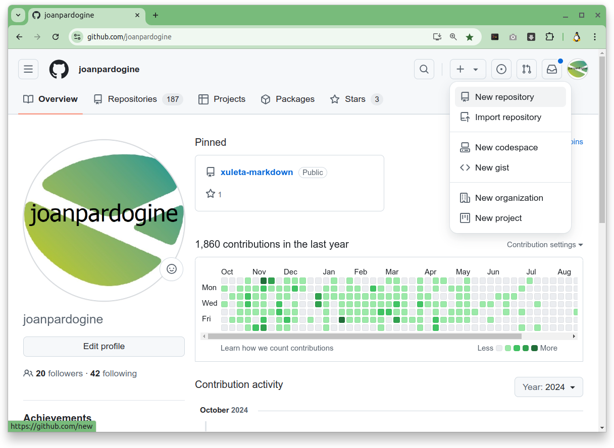
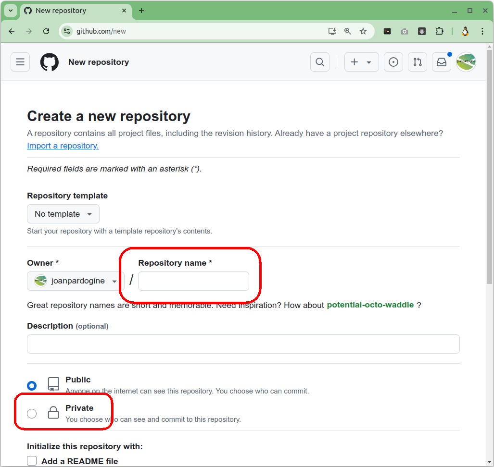
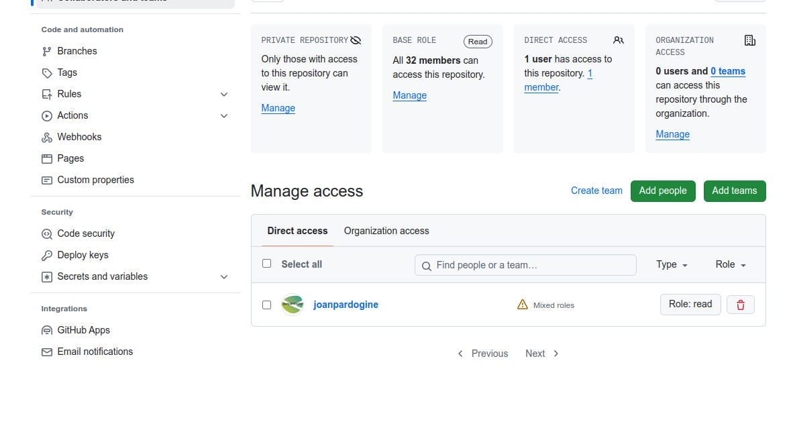

# Explicació de git (segona part)


<details>
<summary>Index</summary>

1. [Verificació de que tenim tots els passos fets correctament](#verificació-de-que-tenim-tots-els-passos-fets-correctament)


1. [Convidar un col·laborador a un repositori personal](#convidar-un-collaborador-a-un-repositori-personal)

</details>

<hr>

## Verificació de que tenim tots els passos fets correctament.

Un cop acabada la primera part, hem de tenir:

**1.** una **carpeta** del vostre portàtil amb dos fitxers **`index.html`** i **`estils.css`**

Per comprovar-ho executarem les següents comandes:

<pre>
pwd
</pre>

La comanda **`pwd`** ens mostrarà la ruta a on ens trobem.

<pre>
ls -la
</pre>

Amb la comanda **`ls`** veurem els fitxers i carpetes que hi ha a la carpeta a on ens trobem, i els paràmetres:
* **`-l`** serveix perque ens mostri tota la informació dels fitxers o carpetes.

* **`-a`** serveix perque ens mostri també els fitxers o carpetes ocultes.

**Comandes**:

```sh
pwd
ls -la
```

> [!TIP]
>
> **Sortida**
><pre>
> joan@jpc-ThinkPad ~/pardo-primer-repositori (main)$ pwd
> /home/joan/pardo-primer-repositori
> joan@jpc-ThinkPad ~/pardo-primer-repositori (main)$ ls -la
> total 20
> drwxrwxr-x  3 joan joan 4096 Oct 11 09:39 .
> drwxr-x--- 74 joan joan 4096 Oct 11 09:37 ..
> -rw-rw-r--  1 joan joan  449 Oct 11 09:39 estils.css
> drwxrwxr-x  8 joan joan 4096 Oct 11 09:39 .git
> -rw-rw-r--  1 joan joan  278 Oct 11 09:38 index.html
> joan@jpc-ThinkPad ~/pardo-primer-repositori (main)$ 
></pre>

**2.** Aquesta carpeta cal que sigui un repositori.

Per confirmar que a aquesta carpeta hi ha un repositori, executarem la comanda **`git status`**.

**Comandes**:

<pre>
git status
</pre>

> [!TIP]
>
> **Sortida**
><pre>
> joan@jpc-ThinkPad ~/pardo-primer-repositori (main)$ git status
> On branch main
> nothing to commit, working tree clean
> joan@jpc-ThinkPad ~/pardo-primer-repositori (main)$ 
></pre>


Si algú de vosaltres no ha arribat amb aquesta situació, cal que repasseu tots els passos fets a la primera part.

## Creació dun repositori remot

A continuació crearem un repositori al vostre compte de **`github.com`**.

1. Des del vostre compte de github.com, cal que pressioneu el simbol <kbd>+</kbd> que hi ha a la part superior dreta del vostre perfil, i al menú desplegable que apareix, seleccioneu l'opció <kbd>New repository<(kbd>. 


    

1. A la finestra **New repository** que us apareix, cal que al camp **Repository name** escriviu el nom del vostre repositori. És una bona pràctica, fer que el nom del repositori sigui el mateix nom que la carpeta que conté el vostre repositori al vostre ordinador.

    En aquest cas crearem un repositori remot que anomenarem **```<PrimerCognom>-primer-repositori```**, (on **```<PrimerCognom>```**  és el **cognom de l'alumne**, sense el **nom**). És important que no poseu ni el simbol **`<`**, ni el simbol **`>`**.

    Per exemple en el meu cas seria **```pardo-primer-repositori```**.

    


    I cal també que marqueu l'opció de **`Private`**.

    Quedaria alguna cosa similar a:
    
    
    

    A continuació ens apareixerà el vostre repositori remot.

    

## Vincular el vostre repositori remot amb el local

Ja tenim un repositori local, la carpeta del vostre ordinador i un repositori remot.

Fixeu-vos que el nostre repositori conté un seguit de comandes:

> [!TIP]
>
><pre>
> echo "# pardo-primer-repositori" >> README.md
> git init
> git add README.md
> git commit -m "first commit"
> git branch -M main
> git remote add origin https://github.com/joanpardogine/pardo-primer-repositori.git
> git push -u origin main
></pre>

D'aquestes comandes ens quedarem només amb les següents:

> [!TIP]
>
><pre>
> git remote add origin https://github.com/joanpardogine/pardo-primer-repositori.git
> git push -u origin main
></pre>

Ara cal tornar al nostre repositori local (la carpeta del vostre ordinador), i executem les següents comandes:

**1.** Confirmem que estem al nostre repositori local, per fer-ho, recordem que la comanda **`pwd`** ens mostrarà la ruta a on ens trobem.

**Comanda**:

```sh
pwd
```

> [!TIP]
>
> **Sortida**
><pre>
> joan@jpc-ThinkPad ~/pardo-primer-repositori (main)$ pwd
> /home/joan/pardo-primer-repositori
> joan@jpc-ThinkPad ~/pardo-primer-repositori (main)$ ls -la
> total 20
> drwxrwxr-x  3 joan joan 4096 Oct 11 09:39 .
> drwxr-x--- 74 joan joan 4096 Oct 11 09:37 ..
> -rw-rw-r--  1 joan joan  449 Oct 11 09:39 estils.css
> drwxrwxr-x  8 joan joan 4096 Oct 11 09:39 .git
> -rw-rw-r--  1 joan joan  278 Oct 11 09:38 index.html
> joan@jpc-ThinkPad ~/pardo-primer-repositori (main)$ 
></pre>

**2.** Confirmem que el nostre repositori local és correcte. Per fer-ho, recordem que la comanda **`git status`** que ens mostrarà l'estat del nostre repositori local.

**Comanda**:

```sh
git status
```

La sortida ha de ser la següent, si no és així, cal que repasseu tots els passos fets a la primera part.
> [!TIP]
>
> **Sortida**
><pre>
> joan@jpc-ThinkPad ~/pardo-primer-repositori (main)$ git status
> On branch main
> nothing to commit, working tree clean
> joan@jpc-ThinkPad ~/pardo-primer-repositori (main)$ 
></pre>

**3.** Crearem un vincle, un enllaç entre el vostre repositori local i el vostre repositori remot. I a aquest enllaç o vincle li donarem el nom de **`origin`**.

Per fer-ho executarem les comandes que ens ha ofert el github un cop creat el vostre repositori remot.

Us les recordo:

> [!TIP]
>
><pre>
> git remote add origin https://github.com/joanpardogine/pardo-primer-repositori.git
> git push -u origin main
></pre>


Amb la comanda **`git remote add origin <URL_del_vostre_repositori_remot>`** crearà un un vincle, un enllaç entre el vostre repositori local i el vostre repositori remot.

(on **```<URL_del_vostre_repositori_remot>```**  és l'adreça **URL del vostre repositori remot**). És important que no poseu ni el simbol **`<`**, ni el simbol **`>`**.

**Comanda**:

```sh
git remote add origin <URL_del_vostre_repositori_remot>
```

> [!TIP]
>
> **Sortida**
><pre>
> joan@jpc-ThinkPad ~/pardo-primer-repositori (main)$ git remote add origin https://github.com/joanpardogine/pardo-primer-repositori.git
> joan@jpc-ThinkPad ~/pardo-primer-repositori (main)$ 
> </pre>

I la comanda **`git push -u origin main`** enviarà TOTS els canvis inclosos al darrer **`commit`** al vostre repositori remot.

**Comanda**:

```sh
git push -u origin main
```

> [!TIP]
>
> **Sortida**
><pre>
> joan@jpc-ThinkPad ~/pardo-primer-repositori (main)$ git push -u origin main 
> Enumerating objects: 4, done.
> Counting objects: 100% (4/4), done.
> Delta compression using up to 8 threads
> Compressing objects: 100% (4/4), done.
> Writing objects: 100% (4/4), 692 bytes | 692.00 KiB/s, done.
> Total 4 (delta 0), reused 0 (delta 0), pack-reused 0
> To https://github.com/joanpardogine/pardo-primer-repositori.git
>  * [new branch]      main -> main
> Branch 'main' set up to track remote branch 'main' from 'origin'.
> joan@jpc-ThinkPad ~/pardo-primer-repositori (main)$ 
> </pre>


A partir dara, cada vegada que modifiqueu un fitxer, per exemple el fitxer **`index.html`**, caldrà executar les comandes, per afegir els canvis al control de **`git`** (**`git add <nomDelFitxerModificat>`**, on **`<nomDelFitxerModificat>`** és el nom o els noms dels fitxers afegits o modificats (És important que no poseu ni el simbol **`<`**, ni el simbol **`>`**.)), per indicar els canvis executar un **`commit`** amb un missatge (**`git commit -m "Missatge que identifiqui els canvis fets"`**) i per últim executar el git push per enviar els canvis fets des del vostre **repositori local** al vostre **repositori remot** (**`git push -u origin main`**):

> [!TIP]
>
><pre>
> git add <nomDelFitxerModificat>
> git commit -m "Missatge que identifiqui els canvis fets"
> git push -u origin main
></pre>

Si ara visiteu el vostre **repositori remot**, ja veureu els canvis fets, és a dir, que ja han pujat els dos fitxers **`index.html`** i **`estils.css`** que tenieu al vostre **repositori local**.


## Convidar un col·laborador a un repositori remot

Per convidar a un col·laborador a un repositori remot cal que des de la pàgina principal del vostre repositori remot, aneu a <kbd>Setting</kbd> a la part superior dreta.


Si no apareix cal que pressioneu al botó que conté tres punts i ja us apareixerà.


Un cop ja sou a pestanya de <kbd>Settings</kbd>, cal que aneu, del menú de la dreta, dins de la secció <kbd>Access</kbd>, escolliu lopció <kbd>Collaborators</kbd>


Us apareixerà la finestra **`Who has access`**.


Feu clic a <kbd>Add people</kbd>.


Al camp de cerca, comenceu a escriure el nom de la persona que voleu convidar 


i, a continuació, feu clic a un nom a la llista de coincidències.


I feu clic a <kbd>Afegeix NOM</kbd> al repositori.



Podeu trobar més informació a [Inviting a collaborator to a personal repository](https://docs.github.com/en/enterprise-server@3.10/account-and-profile/setting-up-and-managing-your-personal-account-on-github/managing-access-to-your-personal-repositories/inviting-collaborators-to-a-personal-repository#inviting-a-collaborator-to-a-personal-repository)